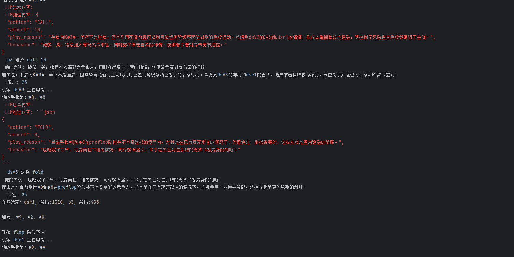
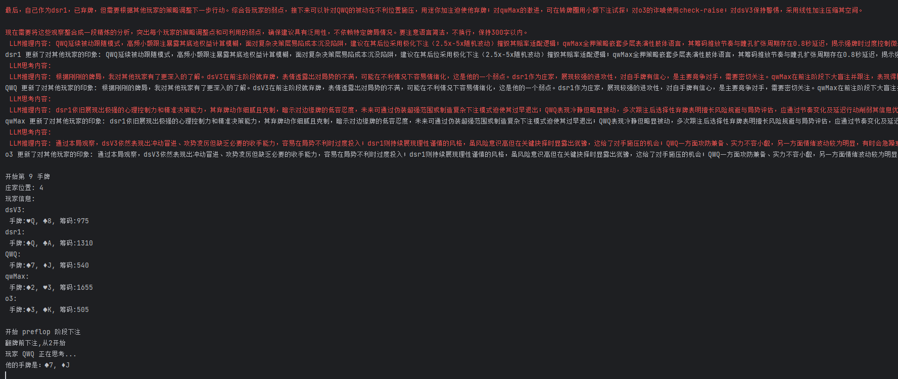

# Poker LLM

[中文](README.md) | English

An AI-powered Texas Hold'em Poker framework driven by Large Language Models

## Project Introduction

This project is a Texas Hold'em Poker AI battle framework that uses Large Language Models (LLMs) as AI players to compete in poker games. The framework simulates the complete Texas Hold'em poker game process, including dealing cards, betting, flop, turn, river, and showdown phases, and supports multiple AI players participating simultaneously. Each AI player is driven by a large language model, capable of making decisions based on the current game state and reflecting on their performance after the game ends.

## How to Run

### Requirements

- Python 3.10+
- Install dependencies: `pip install -r requirements.txt` (mainly depends on the openai library)

### Configure API Keys

Before running, you need to configure the API key and base URL for the large language model in `main.py`. Currently, two types of LLM players are supported:

1. Models with OpenAI-compatible interface (such as Deepseek, QWen, etc.):
```python
players.append(OpenAiLLMUser(name="Player Name", model_name="Model Name", api_key='YOUR_API_KEY', base_url="YOUR_BASE_URL"))
```

2. Anthropic Claude model:
```python
players.append(AnthropicLLMUser(name="Player Name", model_name="Model Name", api_key='YOUR_API_KEY', base_url="YOUR_BASE_URL"))
```

Please choose the appropriate configuration method based on the model type you are using, and fill in the corresponding API key and base URL.

### Start the Game

Simply run the `main.py` file to start the game:

```bash
python main.py
```

### Game Replay

You can use replay_game.py directly:

```bash
python replay_game.py
```

You can adjust the game settings by modifying the parameters in `main.py`:

```python
start_game(players, hands=10, chips=1000, small_blind=5, big_blind=10)
```

- `hands`: Number of hands to play
- `chips`: Initial chips for each player
- `small_blind`: Small blind amount
- `big_blind`: Big blind amount

## File Structure

- `main.py`: Main program entry, used to configure and start the game
- `game_controller.py`: Game controller, manages battles between multiple AI players
- `poker_engine.py`: Texas Hold'em poker game engine, implements game rules and logic
- `ai_player.py`: AI player interface and implementation, including LLM-based player implementation
- `engine_info.py`: Game basic data structures, such as cards, suits, action types, etc.
- `game_info.py`: Game state information structure, used for AI decision-making and game recording
- `prompt/`: Prompt directory
  - `decision_prompt.txt`: Prompt template for AI decision-making
  - `reflect_prompt.txt`: Prompt template for AI reflection
  - `reflect_all_prompt.txt`: Prompt template for AI to reflect on all players
- `replay_game.py`: Game replay tool
- `prompts.py`: Prompt management
- `requirements.txt`: Project dependencies

## Game Process

1. Initialize the game, set blinds and initial chips
2. Deal hole cards to each player
3. Pre-flop betting round
4. Deal the flop and betting round
5. Deal the turn and betting round
6. Deal the river and betting round
7. Showdown and determine the winner
8. Distribute chips and record game results
9. AI players reflect on the current game
10. Start a new round

## Known Issues

1. ~~**Side Pot Calculation Issue**: The current version does not calculate winner chips according to side pots. There is an `award_pot_new` method in `poker_engine.py` that implements side pot calculation, but the simplified `award_pot` method is currently used, which does not consider side pot situations.~~

2. **Incomplete Output**: The information output during the game is not comprehensive, and some key information may not be displayed.

## Extended Features

- Support for game log recording and replay
- AI players can analyze and reflect on other players
- Different large language models can be customized as AI players
- Support for adjusting game parameters, such as blind size, initial chips, etc.

## Program Screenshots

Showing LLM call results and reasoning process


Showing the process of LLM analyzing other players' behavior
